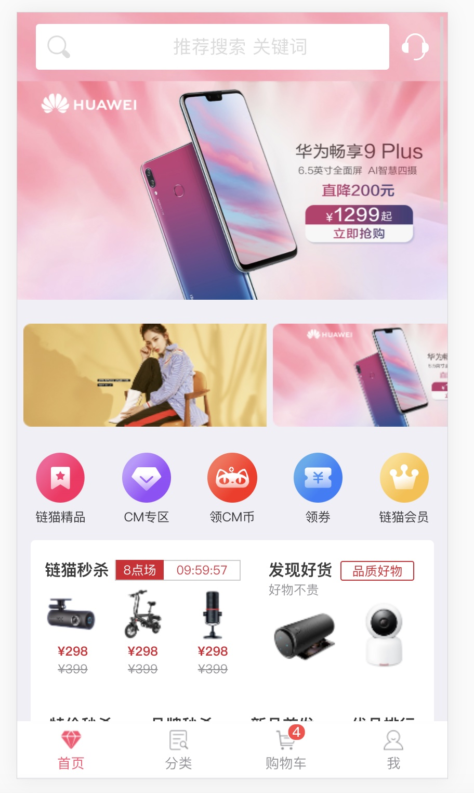
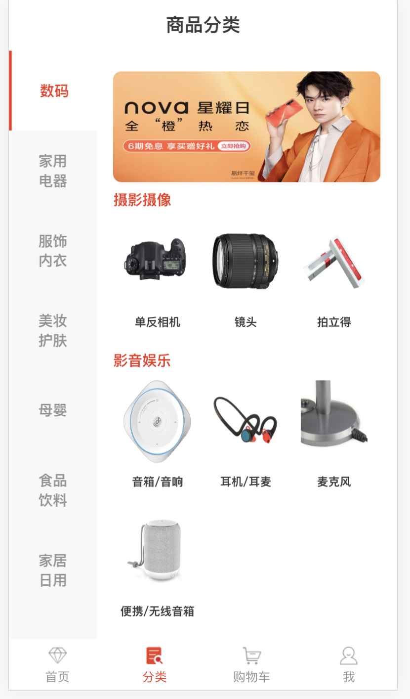

<!--
 * @Description: 
 * @version: v 1.0.0
 * @Github: https://github.com/GitHubGanKai
 * @Author: GitHubGanKai
 * @Date: 2020-03-22 19:42:39
 * @LastEditors: gankai
 * @LastEditTime: 2020-04-21 22:45:27
 * @FilePath: /vue-jd-h5/README.md
 -->
<!--  -->
<!--  -->

# whale-mall-h5

<p algin='center'>
  <a href="#"></a>
  <a href="#"></a>
 <a href="https://codecov.io/gh/GitHubGanKai/vue-jd-h5">
  
</a>
</p>

<div style="text-align:center">

</div>
<!-- 
 -->


## 项目介绍

`whale-mall-h5`是一个电商 H5 页面前端项目，基于 Vue+Vant UI 实现，主要包括首页、分类页面、我的页面、购物车等。

📖本地线下代码在分支<a target='_blank' href='https://github.com/GitHubGanKai/vue-jd-h5/blob/demo/README.md'>demo</a>中，使用mockjs数据进行开发，效果图请点击🔗<a target='_blank' href='http://gankai.gitee.io/vue-jd-h5/index'>这里</a>

⚠️master分支是线上生产环境代码，因为部分后台接口已经挂了😫，可能无法看到实际效果<a target='_blank' href='http://jc.cmall.world/#/'>🔗项目线上地址</a>

📌 本项目还有很多不足之处，如果有想为此做贡献的伙伴，也欢迎给我们提出PR，或者issue ；

🔑 本项目是免费开源的，如果有伙伴想要在次基础上进行二次开发，可以clone或者fork整个仓库，如果能帮助到您，我将感到非常高兴，如果您觉得这个项目不错还请给个start！🙏

## 手机扫描二维码预览 👇

<!--  -->
<div style="display: flex;
    justify-content: center;
    align-items: center;">

</div>

## 搭建步骤

- 下载 node 并安装：[https://nodejs.org/dist/v8.9.4/node-v8.9.4-x64.msi](https://nodejs.org/dist/v8.9.4/node-v8.9.4-x64.msi);
- 克隆源代码到本地，使用 IDEA 打开，并完成编译;

- 在 IDEA 命令行中运行命令：npm install,下载相关依赖;

  **development**

- 在 IDEA 命令行中运行命令：npm run dev,运行项目;

  **production**

- 在 IDEA 命令行中运行命令：npm run dll:build,运行项目;


### 技术选型

| 技术              | 说明             | 官网                                                                                                                                                                                                                                                                                                                                                                                       |
| ----------------- | ---------------- | ------------------------------------------------------------------------------------------------------------------------------------------------------------------------------------------------------------------------------------------------------------------------------------------------------------------------------------------------------------------------------------------ |
| Vue               | 前端框架         | [https://vuejs.org/](https://vuejs.org/)                                                                                                                                                                                                                                                                                                                                                   |
| Vue-router        | 路由框架         | [https://router.vuejs.org/](https://router.vuejs.org/)                                                                                                                                                                                                                                                                                                                                     |
| Vuex              | 全局状态管理框架 | [https://vuex.vuejs.org/](https://vuex.vuejs.org/)                                                                                                                                                                                                                                                                                                                                         |
| Vant              | 前端 UI 框架     | [https://youzan.github.io/vant/#/zh-CN/intro](https://youzan.github.io/vant/#/zh-CN/intro)                                                                                                                                                                                                                                                                                                 |
| Axios             | 前端 HTTP 框架   | [https://github.com/axios/axios](https://github.com/axios/axios)                                                                                                                                                                                                                                                                                                                           |
| vue-clipboard2    | 复制控件         | [https://github.com/Inndy/vue-clipboard2](https://github.com/Inndy/vue-clipboard2)                                                                                                                                                                                                                                                                                                         |
| vue-element-admin | 项目脚手架参考   | [https://github.com/PanJiaChen/vue-element-admin](https://github.com/PanJiaChen/vue-element-admin)                                                                                                                                                                                                                                                                                         |
| 前端 H5 UI 地址   | UI 高保真地址    | [https://lanhuapp.com/web/#/item/project/board/detail?pid=cf279f00-9937-489e-975c-b35a1130f643&project_id=cf279f00-9937-489e-975c-b35a1130f643&image_id=764b8364-b1a0-4533-90c9-793ff584f07d](https://lanhuapp.com/web/#/item/project/board/detail?pid=cf279f00-9937-489e-975c-b35a1130f643&project_id=cf279f00-9937-489e-975c-b35a1130f643&image_id=764b8364-b1a0-4533-90c9-793ff584f07d) |

### 项目布局

```lua
src -- 源码目录
├── assets -- 静态图片资源文件
├── components -- 通用组件封装
├── icons -- svg矢量图片文件
├── plugins -- axios网络请求定义
├── router -- vue-router路由配置
├── store -- vuex的状态管理
├── styles -- 全局css样式
├── utils -- 工具类
├── App.vue -- 入口页面
└── views -- 前端页面
    ├── home -- 首页
    ├── classify -- 分类
    ├── login -- 登录页
    ├── mine -- 我的页面
    ├── shopCart -- 购物车页面
    └── error -- 错误页面
```

